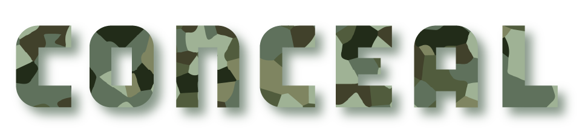
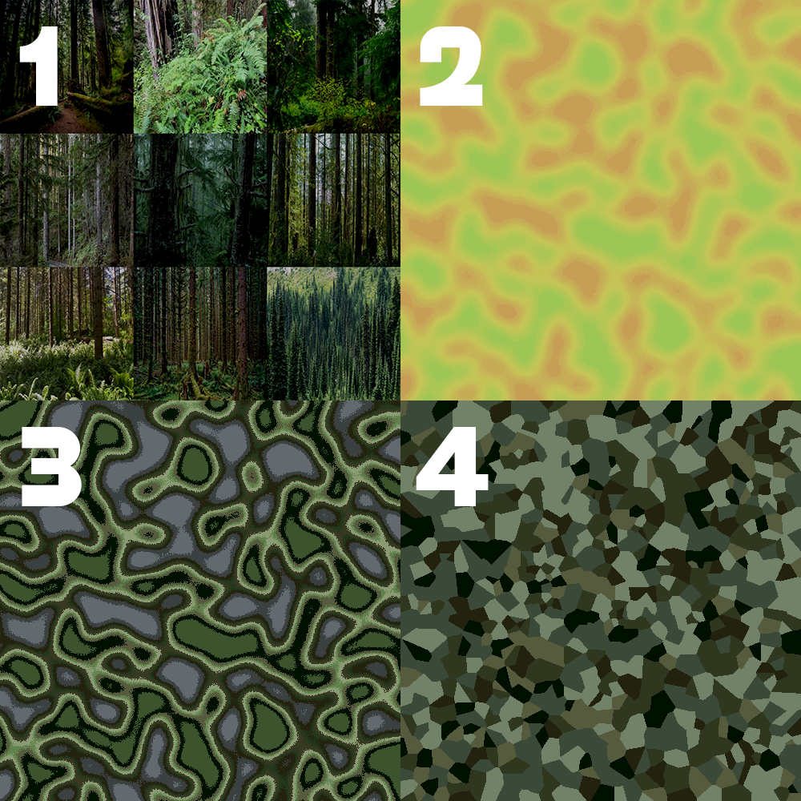

<h1 align="center">
	
</h1>
<h3 align="center">
	conceal is a python package for developing a digital/fractal camouflage image
</h3>
<p align="center">
	<strong>
		<a href="https://pypi.org/project/qsml/">PyPi</a>
		•
		<a href="https://medium.com/@thesjef/introducing-the-national-algorithm-b9570df083a4">The National Algorithm</a>
		•
		<a href="https://repository.tudelft.nl/view/tno/uuid:ea8d8f5b-05d9-4070-8e9d-267849dabef1">TU Delft White Paper</a>
	</strong>
</p>
<p align="center">
  
  
  <a href="https://badge.fury.io/py/conceal"></a>
  
	
</p>
<h6 align="center">
1. collage, 2. noise, 3. palette swap, 4. voronoi tesellation
</h6>
<h1 align="center">
	
</h1>


## Information

> following in the footsteps of the article "Introducing the National Algorithim" by Sjef van Gaalen about the new camouflage patterns of The Netherlands (NFP), this package aims to create a digital/fractal camouflage based upon images of the environment and supplied required colors.

## Installation

```
git clone https://github.com/michaelpeterswa/conceal.git
```
or
```
pip3 install conceal
```

Or download the file manually.

## Release History

- 1.0.00
  - Opened Repository (08.26.2020)

## Meta

Michael Peters - michael@michaelpeterswa.com
       
## License   
MIT
